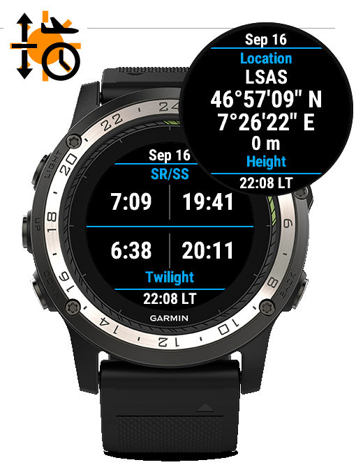

PilotSRSS (Garmin ConnectIQ) Widget
===================================
Pilot SR/SS/Twilight hours for Garmin ConnectIQ devices

   

PilotSRSS is a Garmin ConnectIQ Widget that displays:
 - Aviation Sunrise/Sunset (SR/SS) time
 - Aviation Civil Twilight (HRH*) time

At the current GPS location or a user-specified location.
At the current date or a user-specified date.

PilotSRSS is a stripped-down version of SunAlmanac, its fully-fledged
counterpart widget (which may be preferred by astronomers, photographers
and other solar disc enthusiasts).

Build, Installation and Usage
-----------------------------

Please refer to the INSTALL and USAGE files.

